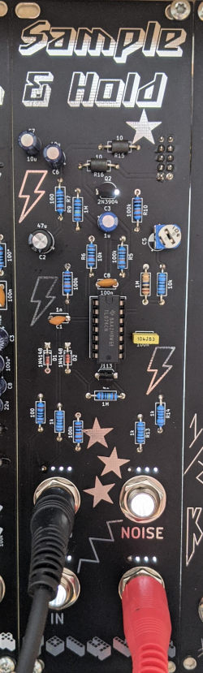
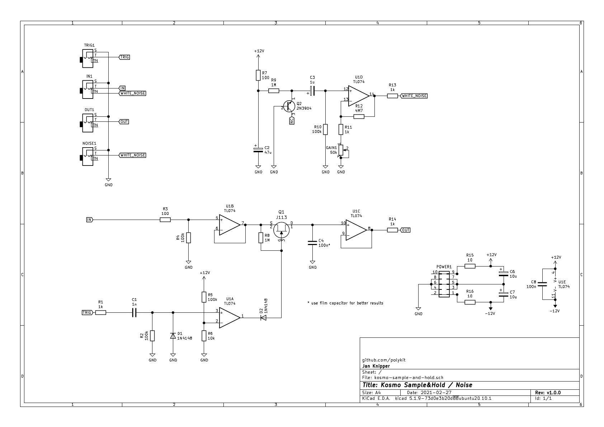

# Kosmo Sample&Hold / Noise module

This repository contains KiCad schematics and PCB layout for a sample and hold / noise module in Kosmo synthesizer format.

## Schematics

## References

https://www.schmitzbits.de/sah.html

https://yusynth.net/Modular/EN/NOISE/index.html

https://i.imgur.com/u3f4tQ6.jpg

https://www.lookmumnocomputer.com/modular

https://github.com/telec16/kicad

https://github.com/holmesrichards/Kosmo_panel
