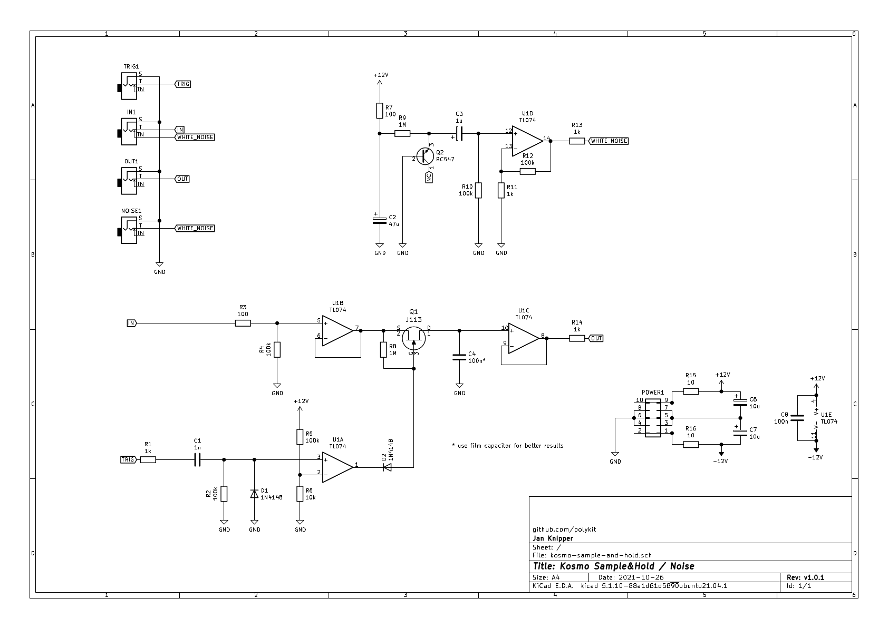

# Kosmo Sample&Hold / Noise module

This repository contains KiCad schematics and PCB layout for a sample and hold / noise module in Kosmo synthesizer format. Gerber files can be found [here](plots).

## Schematics

## BOM

|Reference             |Quantity|Value               |
|----------------------|--------|--------------------|
|C1                    |1       |1n                  |
|C2                    |1       |47u                 |
|C3                    |1       |1u                  |
|C4                    |1       |100n*               |
|C6 C7                 |2       |10u                 |
|C8                    |1       |100n                |
|D1 D2                 |2       |1N4148              |
|GAIN1                 |1       |50k                 |
|IN1 OUT1 NOISE1 TRIG1 |4       |6.35mm audio jacks  |
|POWER1                |1       |10 pin IDC connector|
|Q1                    |1       |J113                |
|Q2                    |1       |2N3904              |
|R1 R11 R13 R14        |4       |1k                  |
|R12                   |1       |4M7                 |
|R15 R16               |2       |10                  |
|R3 R7                 |2       |100                 |
|R2 R4 R5 R10          |4       |100k                |
|R6                    |1       |10k                 |
|R8 R9                 |2       |1M                  |
|U1                    |1       |TL074               |

\* use film capacitor for better results

## References

https://www.schmitzbits.de/sah.html

https://yusynth.net/Modular/EN/NOISE/index.html

https://i.imgur.com/u3f4tQ6.jpg

https://www.lookmumnocomputer.com/modular

https://github.com/telec16/kicad

https://github.com/holmesrichards/Kosmo_panel
